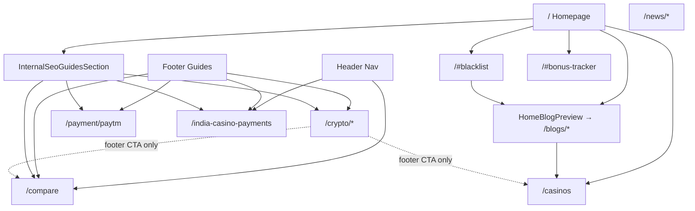
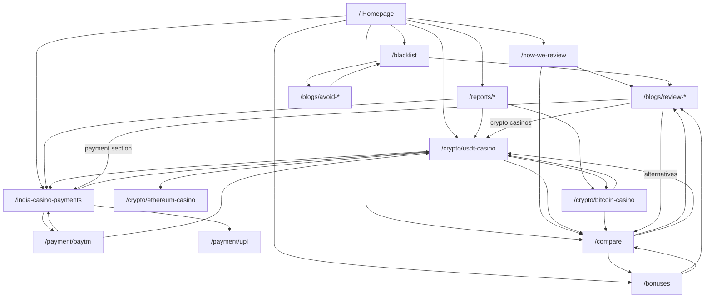

# Authority Flow Map — CasinoPulse

**Date:** July 2026  
**Goal:** Concentrate internal PageRank and user discovery toward high-intent programmatic URLs

---

## Priority Money Pages (Authority Sinks)

```text
/crypto/usdt-casino          ← Primary crypto intent
/crypto/bitcoin-casino       ← Primary BTC intent
/payment/paytm               ← Primary payment intent
/india-casino-payments       ← Payment cluster hub
/compare                     ← Commercial comparison intent
/blacklist                   ← Trust/safety (planned)
/bonuses                     ← Bonus intent (planned)
/how-we-review               ← E-E-A-T hub (planned)
```

---

## Current Link Graph (Simplified)



**Current issues:**
- `/blogs/review-*` rarely link **out** to crypto/payment hubs
- Blacklist/bonus data trapped on homepage hashes (non-indexable)
- News articles don't link to programmatic guides
- Programmatic pages don't cross-link to each other (except footer boilerplate)
- `/casinos` listing doesn't link to `/compare` or payment hubs

---

## Recommended Link Graph



---

## Hub & Spoke Model

| Hub | Spokes (must link bidirectionally) |
|-----|-------------------------------------|
| **Crypto hub** | usdt, bitcoin, ethereum, TRON (future), crypto report |
| **Payment hub** | paytm, upi, bKash, JazzCash, india-casino-payments, payments report |
| **Trust hub** | blacklist, avoid-* blogs, how-we-review |
| **Commercial hub** | compare, bonuses, top reviews |
| **Geo hub** | india, bangladesh, pakistan landing pages |

---

## Implementation Checklist

### Phase A — Quick (existing pages)

- [ ] Add “Related guides” block on each `/crypto/*` page linking sibling crypto + `/compare`
- [ ] Add payment cross-links on `/payment/paytm` → `/india-casino-payments` + `/crypto/usdt-casino`
- [ ] Inject contextual links in review templates when `cryptoSupport: true` → `/crypto/usdt-casino`
- [ ] Link `/casinos` hero/CTA to `/compare` and `/india-casino-payments`
- [ ] Expand `internal-seo-links.ts` when new priority URLs ship

### Phase B — Template updates

- [ ] BlogContent component: auto “Payment options” + “Crypto options” sections with hub links
- [ ] ProgrammaticPageLayout: dynamic related links from same cluster
- [ ] News articles: editorial inline links to guides (when content expanded)

### Phase C — New indexable hubs

- [ ] `/blacklist` receives links from all avoid reviews + homepage
- [ ] `/bonuses` receives links from reviews + homepage widget (replace hash)
- [ ] `/how-we-review` linked from every review footer

---

## Anchor Text Guidelines

| Target | Preferred anchors |
|--------|-------------------|
| `/crypto/usdt-casino` | “USDT casinos”, “best USDT casino sites” |
| `/crypto/bitcoin-casino` | “Bitcoin casino guide”, “BTC casinos” |
| `/payment/paytm` | “Paytm casino payments”, “Paytm deposit guide” |
| `/india-casino-payments` | “India casino payment methods”, “UPI casino payments” |
| `/compare` | “compare online casinos”, “casino comparison” |
| `/blacklist` | “casino blacklist”, “casinos to avoid” |

Avoid exact-match over-optimization on every link — vary with branded and natural phrases.

---

## Authority Flow KPIs

| Metric | Current | Target (90d) |
|--------|---------|--------------|
| Inbound internal links to `/crypto/usdt-casino` | ~8 | 25+ |
| Inbound internal links to `/compare` | ~10 | 30+ |
| Review pages linking to programmatic hubs | ~0 | 40+ |
| Indexable trust/commercial hubs | 2 | 5+ |
